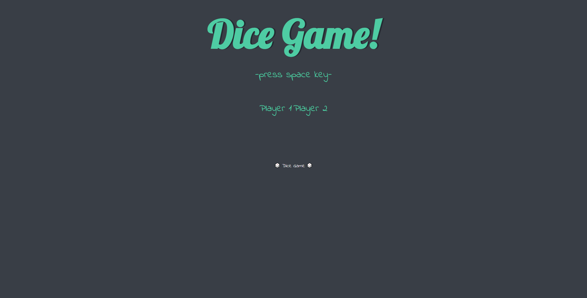

# 002_Second_Step-JavaScript

# Please enjoy my app  
<a href="https://tickkun-portfolio.herokuapp.com/projects/portfolio/secondstep/"> Dice! <a>  

This is what I learned about JavaScript.  
This is what I learned in a class called The Complete 2022 Web Development Bootcamp on udemy.  
https://www.udemy.com/course/the-complete-web-development-bootcamp/  
 
  
 
  
 
  
 
  
